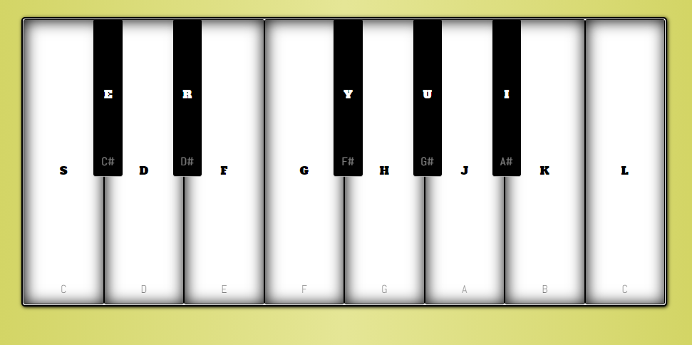

# JS-Piano
A simple piano visualization using javascript.

Live demo: https://faaa97.github.io/JS-Piano/

Key samples were obtained from [University of Iowa](http://theremin.music.uiowa.edu/MISpiano.html), then converted to mp3 and cropped the first second.
 
